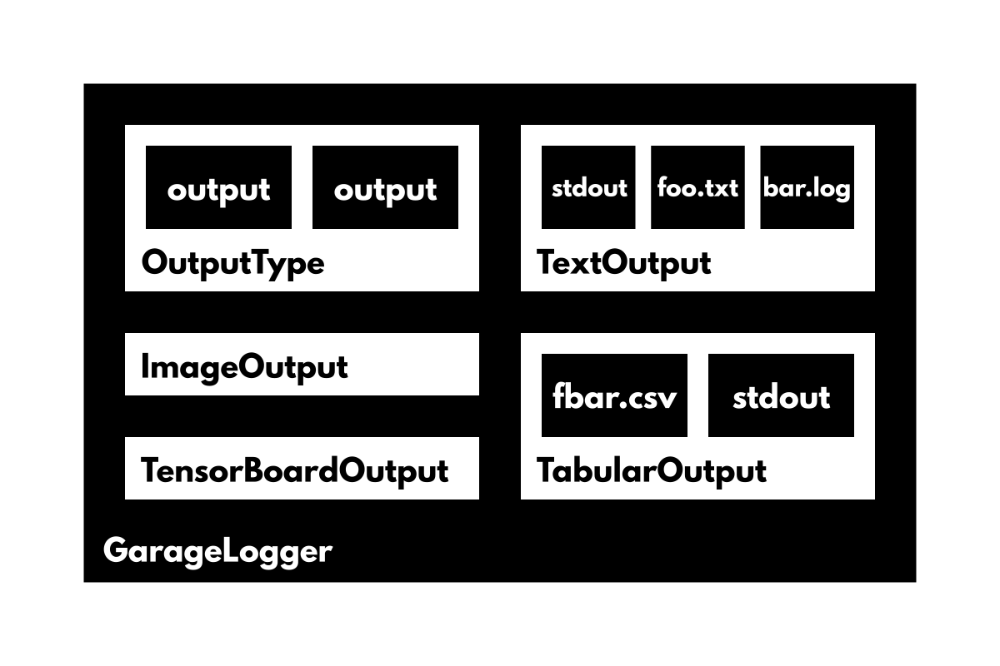

# GarageLogger

The current logger is simply a collection of global variables that needs to be replaced with a new class. I'm calling this new class **GarageLogger**.

I'm planning on using [jruere/multiprocessing-logging](https://github.com/jruere/multiprocessing-logging) to handle multiprocessing. This will make it much easier for all your processes to log to the same place: essentially all it does is wrap a python logger so it plays well in a multiprocessing environment. GarageLogger will abstract all of this away so you don't have to worry about it.

The new logger will have one `add_output` method that takes in both the type of output and any arguments needed for that type. Each output will be its own implementation of an **OutputType** abstract class, which will contain a multiprocessing logger and handle writing to any outputs assigned. GarageLogger will keep a dictionary of the current OutputTypes. For example: **TextOutput**, **TabularOutput**, or **TensorboardOutput**

It will also of course have a `log` method which takes in both the type of output (text by default) and the data to be sent to the logger. The type will use GarageLogger's dictionary to map to the correct OutputType, to which it will pass the data.

The logger will also have python's standard `debug`, `info`, `warning`, `error`, and `critical` methods (even `checkpoint` as a separate log level?), which will log to the text output by default.
